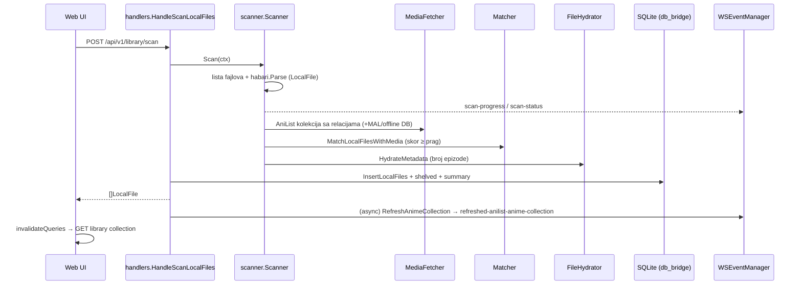
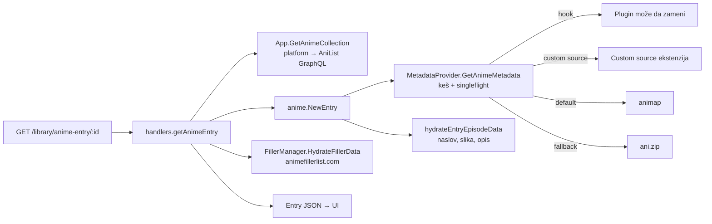
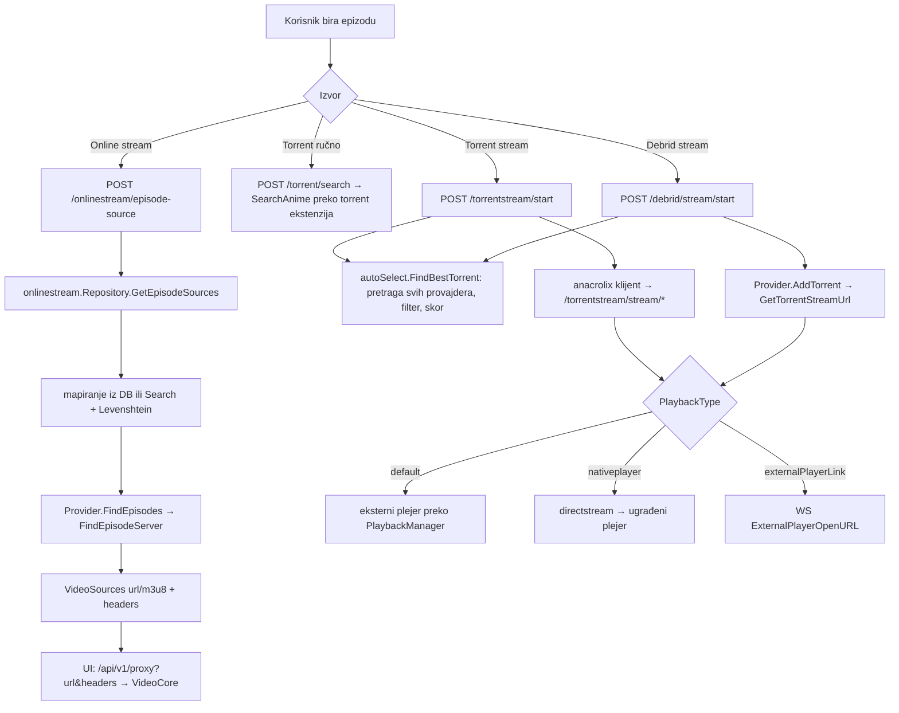
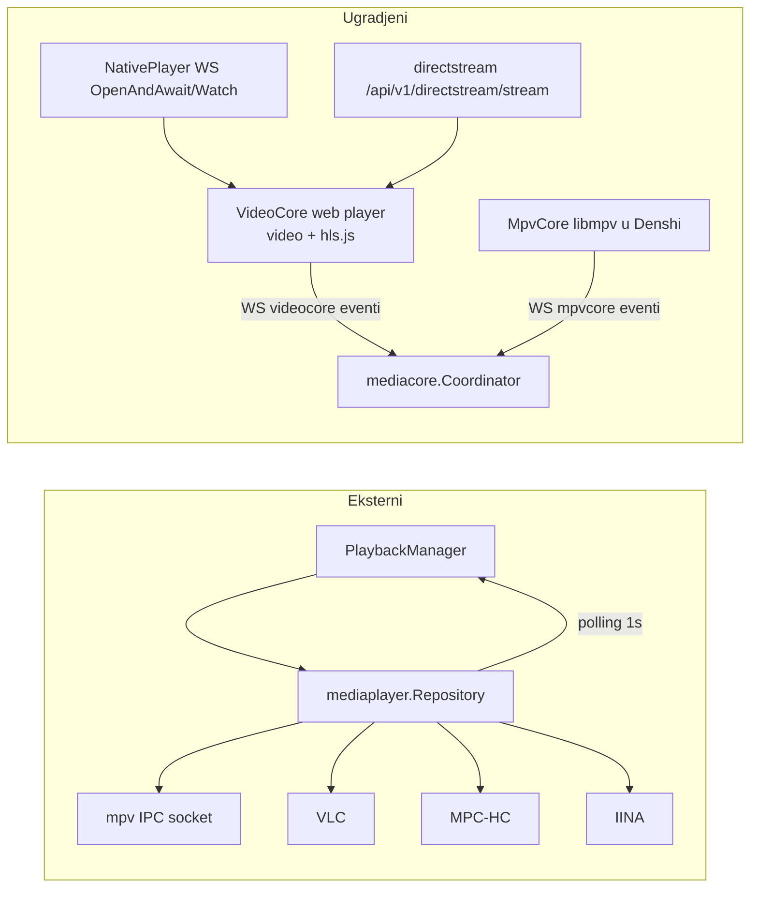
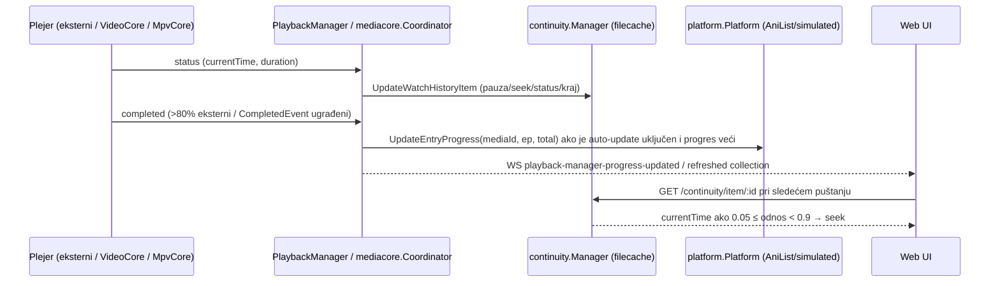

# 01 — Arhitektura Seanime-a (Faza 1, samo analiza)

> Referentni projekat: **Seanime** (GPL-3.0), plitki klon u `C:\Users\Nikola\Desktop\Projekti\_ref\seanime`, commit `2da73d9` (2026-09-20).
> Sve putanje oblika `seanime/...` su relativne u odnosu na koren klona. Format reference: `seanime/putanja/fajl:linija`.
> Ovaj dokument služi **samo kao inspiracija** za AnimeDesk. GPL kod se NE kopira 1:1 (vidi sekciju 8).
> Gde nešto nije lično provereno u kodu, piše **„nije provereno"**.

---

## 1. Pregled

### 1.1 Šta je Seanime

Seanime je samostalni „media server" za anime i mangu: Go server koji ugrađuje (embed) web UI i služi ga preko HTTP-a, uz opcioni Electron desktop omotač.

- Ulazna tačka je minimalna: `main.go` ugrađuje folder `web` (`//go:embed all:web`) i logo, pa zove `server.StartServer` — `seanime/main.go:8-16`.
- Help tekst CLI-ja opisuje aplikaciju kao „The Anime and Manga media server." — `seanime/internal/core/flags.go:29`.
- Verzija servera: `Version = "3.10.3"` — `seanime/internal/constants/constants.go:9`.
- Zvanični opis steka u repou — `seanime/DEVELOPMENT_AND_BUILD.md:5-20`.

### 1.2 Folderi na vrhu

| Folder / fajl | Namena | Referenca |
|---|---|---|
| `main.go` | Go ulazna tačka, embed `web/` + logo | `seanime/main.go:8-16` |
| `internal/` | Ceo backend (≈55 paketa, vidi §2) | — |
| `seanime-web/` | React frontend (Rsbuild + TanStack Router) | `seanime/seanime-web/package.json:6-19` |
| `seanime-denshi/` | Electron desktop omotač („Denshi") | `seanime/seanime-denshi/package.json:2-5` |
| `mobile/` | Go paket `mobile` sa sopstvenim `StartServer(dataDir, cacheDir, port)` i embed `web` | `seanime/mobile/mobile.go:10-13` |
| `codegen/` | Go generator TS tipova/endpointa iz handler komentara | `seanime/codegen/main.go:1-56` |
| `docs/` | Samo `images/` (slike za README) | provereno listanjem foldera |
| `test/` | `config.example.toml` + `testdata` za testove | `seanime/DEVELOPMENT_AND_BUILD.md:183-188` |
| `.github/workflows/` | CI: `release-draft-new.yml`, `electron-build.yml` | §6 |
| `DEVELOPMENT_AND_BUILD.md`, `CHANGELOG.md`, `CONTRIBUTING.md` | dokumentacija | — |

### 1.3 Tehnički stek sa verzijama

**Backend (`seanime/go.mod`)**
- Go `1.27.1` — `seanime/go.mod:3`
- HTTP: `github.com/labstack/echo/v4 v4.15.4` — `seanime/go.mod:41`; logger middleware `ziflex/lecho/v3 v3.11.1` — `seanime/go.mod:54`
- WebSocket: `gorilla/websocket v1.5.3` — `seanime/go.mod:35`
- DB: `gorm.io/gorm v1.31.2` + `glebarez/sqlite v1.11.0` (čist-Go SQLite) — `seanime/go.mod:65`, `seanime/go.mod:29`
- JS runtime za ekstenzije: `dop251/goja` + `goja_nodejs` — `seanime/go.mod:23-24`; TS→JS: `evanw/esbuild v0.28.2` — `seanime/go.mod:26`
- Torrent: `anacrolix/torrent v1.61.0` — `seanime/go.mod:16`
- Parsiranje imena fajlova: `5rahim/habari v0.1.12` — `seanime/go.mod:7`
- Logging: `rs/zerolog v1.35.1` — `seanime/go.mod:47`
- Headless browser za ekstenzije: `chromedp/chromedp v0.16.0` — `seanime/go.mod:20`
- System tray: `fyne.io/systray v1.12.0` — `seanime/go.mod:4`
- Konfiguracija: `spf13/viper` (TOML) — `seanime/internal/core/config.go:14`, `:143-145`

**Frontend (`seanime/seanime-web/package.json`)**
- React `^19` — `seanime/seanime-web/package.json:113`, `:118`
- Bundler: `@rsbuild/core ^2.1.3` + `@rsbuild/plugin-react` — `seanime/seanime-web/package.json:143-145` (napomena: `DEVELOPMENT_AND_BUILD.md:15` još pominje Vite/Next.js — dokumentacija je zastarela u odnosu na `package.json`)
- Ruting: `@tanstack/react-router ^1.170.17` + `@tanstack/router-plugin` — `:57`, `:147`
- Server state: `@tanstack/react-query ^5.101.2` — `:55`; HTTP: `axios ^1.18.1` — `:67`
- Globalni state: `jotai ^2.20.1` (+ `jotai-immer`, `jotai-family`, `jotai-optics`, `jotai-scope`) — `:93-98`
- UI: Radix primitives — `:33-50`; Tailwind `^3.4.17` — `:165`; `class-variance-authority`, `tailwind-merge` — `:71`, `:133`
- Video: `hls.js 1.6.16` — `:89`; ASS titlovi `jassub ^2.5.6` — `:92`; `anime4k-webgpu` — `:66`; `@mpv-prism/core|react` (sopstveni mpv paket preko URL-a) — `:31-32`
- Ostalo: `zod`, `react-hook-form`, `react-virtuoso`, `cmdk`, `sonner` — `:140`, `:122`, `:127`, `:73`, `:132`
- TypeScript `^7.0.2`, `vitest ^4.1.10` — `:166-167`

**Desktop (`seanime/seanime-denshi/package.json`)**
- Electron `42.4.0` — `seanime/seanime-denshi/package.json:31`; `electron-builder ^25.1.8` — `:32`
- `electron-updater ^6.7.3`, `electron-log ^5.4.3` — `:21-22`
- `@mpv-prism/electron` (libmpv integracija) — `:18`; Chromecast: `castv2`, `mdns-js` — `:20`, `:23`
- Verzija `3.10.3` — `:3`

---

## 2. Backend (`internal/`)

### 2.1 Spisak paketa (jedna rečenica po paketu)

| Paket | Namena | Referenca |
|---|---|---|
| `api/anilist` | AniList GraphQL klijent (gqlgenc generisan) + `queries/*.graphql`, endpoint `https://graphql.anilist.co` | `seanime/internal/constants/constants.go:15`, `seanime/DEVELOPMENT_AND_BUILD.md:147-176` |
| `api/animap` | Glavni izvor metapodataka epizoda (interni metadata URL, base64-kodiran) | `seanime/internal/api/animap/animap.go:90`, `seanime/internal/constants/constants.go:26` |
| `api/anizip` | Fallback metapodaci (`https://api.ani.zip/v1/episodes`) | `seanime/internal/api/anizip/anizip.go:94` |
| `api/animeofflinedb` | manami-project anime-offline-database (za „enhanced" skeniranje) | `seanime/internal/api/animeofflinedb/animeofflinedb.go:17` |
| `api/filler` | Scraper `animefillerlist.com` | `seanime/internal/api/filler/filler.go:47` |
| `api/mal` | MyAnimeList pretraga (koristi je scanner) | `seanime/internal/library/scanner/media_fetcher.go:338-341` |
| `api/mangaupdates` | MangaUpdates API (nije provereno detaljno) | folder postoji |
| `api/metadata` | Tipovi `AnimeMetadata`/`EpisodeMetadata` | `seanime/internal/api/metadata/types.go:45-60` |
| `api/metadata_provider` | Keširani provajder metapodataka (animap → anizip fallback, custom source) | `seanime/internal/api/metadata_provider/provider.go:108-180`, `:296-358` |
| `constants` | Verzija, URL-ovi | `seanime/internal/constants/constants.go:9-26` |
| `continuity` | Istorija gledanja (pozicija u epizodi) za „resume" | `seanime/internal/continuity/history.go:16-18` |
| `core` | `App` kontejner, bootstrap, config, Echo, moduli | §2.2 |
| `cron` | Periodični poslovi (refresh AniList, sync, release check) | `seanime/internal/cron/cron.go:12-23` |
| `customsource` | Menadžer „custom source" ekstenzija (alternativni izvori medija umesto AniList ID-a) | `seanime/internal/customsource/customsource.go:57-58` |
| `database` (`db`, `db_bridge`, `models`) | GORM/SQLite sloj, modeli, settings | §2.5 |
| `debrid` (`client`, `debrid`, `realdebrid`, `torbox`, `alldebrid`, `premiumize`, `dummy`) | Debrid provajderi + stream menadžer | `seanime/internal/debrid/debrid/debrid.go:17-31` |
| `directstream` | Servira lokalni fajl/torrent/debrid/URL stream ka ugrađenom (native) plejeru | `seanime/internal/directstream/debridstream.go:57`, `seanime/internal/handlers/routes.go:469-473` |
| `discordrpc` | Discord Rich Presence | `seanime/internal/discordrpc/presence/hook_events.go:8-10` |
| `doh` | DNS-over-HTTPS | `seanime/internal/core/app.go:286` |
| `events` | WebSocket event menadžer ka frontendu | §2.4 |
| `extension` (+ `hibike/*`) | Tipovi ekstenzija i interfejsi provajdera | §5 |
| `extension_playground` | Izvršavanje test-koda ekstenzija iz UI-ja | `seanime/internal/handlers/routes.go:500` |
| `extension_repo` | Učitavanje/instalacija/marketplace ekstenzija, goja provajderi | §5 |
| `goja` (`goja_runtime`, `goja_bindings`) | Pool goja VM-ova + JS binding-zi (fetch, document, crypto, chromedp…) | `seanime/internal/goja/goja_runtime/goja_runtime_manager.go:22-54` |
| `handlers` | Svi HTTP handleri + `routes.go` | §2.3 |
| `hook`, `hook_resolver` | Interni event/hook sistem (za pluginove) | `seanime/internal/hook/hook.go:66-166` |
| `icon` | Ikonice za tray | folder |
| `library/anime` | Domen: `LocalFile`, `Entry`, `Episode`, `LibraryCollection`, auto-select profili | §2.7 |
| `library/scanner` | Skener lokalnih fajlova + matcher + hydrator | §2.7 |
| `library/autoscanner` | Automatsko skeniranje na promene fajlova | `seanime/internal/library/autoscanner/autoscanner.go:89-127` |
| `library/autodownloader` | Pravila za automatsko preuzimanje novih epizoda preko torrenta | `seanime/internal/library/autodownloader/autodownloader.go:197-295` |
| `library/fillermanager` | Filler podaci po epizodi | `seanime/internal/library/fillermanager/fillermanager.go:186-266` |
| `library/playbackmanager` | Puštanje u eksternom plejeru + praćenje progresa | §7(d), §7(e) |
| `library/filesystem`, `library/summary` | FS pomoćne funkcije, izveštaj skeniranja | `seanime/internal/library/summary/scan_summary.go:82` |
| `library_explorer` | Stablo fajlova biblioteke za UI | `seanime/internal/library_explorer/explorer.go:56` |
| `local` | Offline režim / lokalna sinhronizacija (sopstvena DB) | `seanime/internal/core/app.go:341-354` |
| `manga` | Manga repozitorijum, poglavlja, downloader | `seanime/internal/manga/chapter_container.go:50-51` |
| `matroska`, `mkvparser`, `pgs` | MKV/EBML parser, titlovi/atačmenti, PGS dekoder | `seanime/internal/matroska/ebml.go:1-6`, `seanime/internal/pgs/pgs.go:31` |
| `mediacore` | Koordinator sesija za ugrađene plejere (videocore/mpvcore): continuity, progres, Discord | §7(e) |
| `mediaplayers` (`mpv`, `mpvipc`, `vlc`, `mpchc`, `iina`, `mediaplayer`) | Eksterni plejeri + zajednički repozitorijum | §2.10 |
| `mediastream` | Transkodiranje/direct play lokalnih fajlova (ffmpeg/ffprobe) | `seanime/internal/mediastream/repository.go:93-98` |
| `mpvcore` | Backend strana „mpv-prism" plejera (libmpv u Denshi-ju) | `seanime/internal/mpvcore/mpvcore.go:22-49` |
| `nakama` | Deljenje biblioteke između instanci + „watch party" | `seanime/internal/nakama/nakama.go:221`, `seanime/internal/handlers/routes.go:582-601` |
| `nativeplayer` | Kontrola „native" plejera u klijentu preko WS (OpenAndAwait/Watch) | `seanime/internal/nativeplayer/events.go:18-28` |
| `notification`, `notifier` | In-app notifikacije (Hub) i OS notifikacije | `seanime/internal/notification/hub.go:3-30`, `seanime/internal/notifier/notifier.go:95` |
| `onlinestream` | Online streaming preko ekstenzija | §7(c) |
| `platforms` (`anilist_platform`, `offline_platform`, `simulated_platform`, `shared_platform`, `platform`) | Apstrakcija „naloga" (AniList / offline / lokalni simulirani) | §2.6 |
| `player` | Zajednički tipovi plejera (`Target`, `PlaybackType`) | `seanime/internal/player/types.go:14-34` |
| `playlist` | Plejliste | `seanime/internal/playlist/manager.go:731` |
| `plugin` (+ `plugin/ui`) | API koji se izlaže JS pluginovima (anilist, playback, storage, UI tray/webview…) | §5 |
| `report` | Izveštaji o greškama (issue report) | `seanime/internal/report/dedup.go:14` |
| `security` | Outbound / secure mode | `seanime/internal/core/app.go:506-511` |
| `server` | `StartServer` za Windows (tray), Unix, Windows-nosystray | §2.2 |
| `torrent_clients` (`qbittorrent`, `transmission`, `builtin_client`, `torrent_client`) | Integracija torrent klijenata | `seanime/internal/core/modules.go:659` |
| `torrents` (`torrent`, `autoselect`, `analyzer`, `availability`) | Pretraga torrenta, rangiranje, analiza fajlova u torrentu | §7(c) |
| `torrentstream` | Streaming torrenta ugrađenim anacrolix klijentom | `seanime/internal/torrentstream/client.go:22` |
| `updater` | Provera/preuzimanje nove verzije (GitHub releases) + self-update | `seanime/internal/updater/check.go:19-20` |
| `user` | `User` entitet za klijent | `seanime/internal/user/user.go:20-21` |
| `util` (+ `filecache`, `proxies`…) | Pomoćni kod; `filecache` = fajl-bazirani key/value keš sa „bucket"-ima i TTL | `seanime/internal/util/filecache/filecache.go:14-47` |
| `vendor_habari` | Vendorisan habari parser (nije provereno detaljno) | folder |
| `videocore` | Backend strana ugrađenog web plejera (VideoCore) | `seanime/internal/videocore/videocore.go:82-152` |
| `testmocks`, `testutil` | Test infrastruktura | `seanime/DEVELOPMENT_AND_BUILD.md:191-196` |

### 2.2 App core / bootstrap / „DI"

Nema DI framework-a — koristi se **ručno sastavljen „God object" `core.App`** sa poljima za svaki servis (`seanime/internal/core/app.go:69-187`).

Tok pokretanja:
1. `main()` → `server.StartServer(WebFS, logo)` — `seanime/main.go:14-16`.
2. Na Windows-u: sakrij konzolu, `startApp`, pa `systray.Run(onReady…)` — `seanime/internal/server/server_windows.go:19-27`. Na Unix-u / `nosystray` build tagu direktno `startAppLoop` — `seanime/internal/server/server_unix.go:9-14`, `seanime/internal/server/server_windows_nosystray.go:9-14`.
3. `startApp`: parsira flagove (`--datadir`, `--host`, `--port`, `--desktop-sidecar`, `--password`…) — `seanime/internal/core/flags.go:24-73`; pravi `NewApp` — `seanime/internal/server/server.go:14-32`.
4. `NewApp` redom (`seanime/internal/core/app.go:195-570`):
   - logger, globalni `HookManager` (`:209-210`), config (`:224`), SQLite DB (`:250`), AniList klijent sa tokenom iz DB (`:268-275`), `WSEventManager` (`:278`), ako je sidecar → gasi se kad nema WS konekcije (`:281-283`), `FileCacher` (`:289`), `ExtensionBank` + `ExtensionRepository` (`:295-305`), metadata provider (`:308-313`), manga repo, platforme AniList/offline/simulated (`:331-380`), onlinestream repo (`:394-401`).
   - **`util.Ref[T]`** kao zamenljive reference (npr. `AnilistPlatformRef`, `MetadataProviderRef`) — servis se može zameniti u runtime-u (offline ↔ online, login/logout) bez ponovnog kreiranja zavisnika — `seanime/internal/core/app.go:84-87`, `:337-338`, `:374-380`.
   - `runMigrations()` (`:514`), `initModulesOnce()` (`:517`) — kreira FillerManager, Continuity, PlaybackManager, TorrentRepository, VideoCore, MpvCore, NativePlayer, Mediacore, Torrentstream, Debrid, AutoDownloader, AutoScanner, Nakama… — `seanime/internal/core/modules.go:56-439` (npr. `:104`, `:115`, `:197`, `:244`, `:312`, `:330`, `:354`).
   - `InitOrRefreshModules()` (`:536`) — moduli koji zavise od podešavanja (media player, torrent klijent, Discord) — `seanime/internal/core/modules.go:457`, `:550`, `:659`. Poziva se ponovo kad se snime podešavanja — `seanime/internal/core/app.go:482-486`.
   - Custom source ekstenzije se učitavaju sinhrono pre AniList podataka, ostale asinhrono — `seanime/internal/core/app.go:539`, `:549`; `seanime/internal/core/extensions.go:11-36`.
5. `startAppLoop`: `NewEchoApp` → `handlers.InitRoutes` → `RunEchoServer` (goroutine) → `cron.RunJobs`; petlja čeka self-updater i prelazi u „update mode" — `seanime/internal/server/server.go:34-79`.

Konfiguracija (fajl `config.toml` u data dir-u, viper/TOML, default port `43211`) — `seanime/internal/core/config.go:101`, `:142-150`. Korisnička podešavanja su u SQLite (`models.Settings`), ne u TOML-u — §2.5.

### 2.3 HTTP API sloj

- Echo instanca, custom JSON serializer (`goccy/go-json`), statičko serviranje ugrađenog `web/` sa HTML5 fallback-om (SPA), osim za `/api`, `/events`, `/assets`, `/manga-downloads`, `/offline-assets` — `seanime/internal/core/echo.go:17-100`.
- COOP/COEP headeri (`same-origin`/`credentialless`) za ne-API rute (potrebno za SharedArrayBuffer/wasm) — `seanime/internal/core/echo.go:47-64`.
- **Sve rute su na jednom mestu**: `handlers.InitRoutes` — `seanime/internal/handlers/routes.go:23`. Middleware redosled: trusted-local, CORS (dozvoljene origin-e + `X-Seanime-Token` headeri), lecho logger sa skip listom, Recover, client-id cookie, HEAD→GET — `seanime/internal/handlers/routes.go:26-118`.
- WS endpoint `GET /events` — `seanime/internal/handlers/routes.go:120`.
- API grupa `/api/v1` + `OptionalAuthMiddleware` + `FeaturesMiddleware` — `seanime/internal/handlers/routes.go:122-128`. Rute su grupisane (`/anilist`, `/library`, `/manga`, `/extensions`, `/continuity`, `/nakama`, …) — npr. `:199`, `:240`, `:387`, `:499`, `:529`, `:582`.
- Handler = metoda na `Handler{App *core.App}` — `seanime/internal/handlers/routes.go:19-21`. Handleri su dokumentovani komentarima `@summary/@desc/@route/@returns` koje čita codegen — npr. `seanime/internal/handlers/scan.go:12-18`.
- Jedinstven oblik odgovora `SeaResponse{error, data}` — `seanime/internal/handlers/response.go:5-27`.
- Generički proksi za video (`/api/v1/proxy`) koji prosleđuje headere iz online stream ekstenzija — `seanime/internal/handlers/routes.go:135-136`, frontend `seanime/seanime-web/src/app/(main)/onlinestream/_lib/onlinestream-proxy.ts:1-2`.

### 2.4 WebSocket / eventi ka frontendu

- `WSEventManager` drži konekcije po `clientId`, ima `SendEvent(type, payload)` (broadcast) i `SendEventTo(clientId, …)` — `seanime/internal/events/websocket.go:16-17`, `:171`, `:206`.
- Poruka je `{type, payload}` — `seanime/internal/events/websocket.go:85-88`.
- Imena evenata su konstante (`scan-progress`, `refreshed-anilist-anime-collection`, `playback-manager-progress-updated`…) — `seanime/internal/events/events.go:20-40`; frontend ih ogleda u `WSEvents` enumu — `seanime/seanime-web/src/lib/server/ws-events.ts:8-12`.
- Dvosmerno: klijent šalje `WebsocketClientEvent{clientId, type, payload}` tipova `native-player`, `videocore`, `mpvcore`, `nakama`, `plugin`, `playlist` — `seanime/internal/events/events.go:3-18`; server ih rutira preko `OnClientEvent`/`SubscribeToClient*Events` — `seanime/internal/events/websocket.go:269-314`.
- Upgrade handler: rate-limit, opciona lozinka preko `?token=`, provera origin-a — `seanime/internal/handlers/websocket.go:20-50`.
- Desktop sidecar: ako nema WS klijenta >10 s posle prve konekcije, server radi `os.Exit(1)` — `seanime/internal/events/websocket.go:112-146`.
- Frontend: jedna WS konekcija na `ws(s)://<server>/events` — `seanime/seanime-web/src/app/websocket-provider.tsx:187-205`, parsiranje `JSON.parse(event.data)` — `:260`; komponente se pretplaćuju hookom `useWebsocketMessageListener` — `seanime/seanime-web/src/app/(main)/_hooks/handle-websockets.ts:284`. Tipičan obrazac: WS event → `queryClient.invalidateQueries` — `seanime/seanime-web/src/app/(main)/_listeners/anilist-collection.listeners.ts:15-19`.

### 2.5 Baza podataka

- SQLite preko GORM-a (`glebarez/sqlite`, čist Go, bez CGO), fajl `<appData>/<name>.db`, WAL, `busy_timeout=30000` — `seanime/internal/database/db/db.go:10`, `:31-39`; `AutoMigrate` — `:88`.
- Modeli: `Settings` sa ugnježdenim (`gorm:"embedded"`) grupama `Library`, `MediaPlayer`, `Torrent`, `Manga`, `Anilist`, `ListSync`, `AutoDownloader`, `Discord`, `Notifications`, `Nakama` — `seanime/internal/database/models/models.go:49-61`. Primer: `MediaPlayerSettings` (default plejer, putanje/portovi VLC/MPC/mpv/IINA, mpv args…) — `:187-211`.
- `db_bridge` sloj za (de)serijalizaciju složenih struktura (local files, rules, playlists…) — `seanime/internal/database/db_bridge/` (npr. `GetLocalFiles`, `InsertLocalFiles` korišćeni u `seanime/internal/handlers/scan.go:47`, `:109`).
- Lokalni fajlovi se čuvaju kao serijalizovan blob (`ShelvedLocalFiles.Value []byte`) — `seanime/internal/database/models/models.go:40-43` (za „shelved"; za glavne LocalFiles nije provereno da li je isti format).
- Odvojeno od DB-a: `filecache` (JSON fajlovi po bucket-u) za keševe i continuity istoriju — `seanime/internal/util/filecache/filecache.go:14-47`, `seanime/internal/continuity/manager.go:57`.

### 2.6 Platform sloj (AniList / offline / simulirani)

- Interfejs `platform.Platform`: `UpdateEntry`, `UpdateEntryProgress`, `GetAnime`, `GetAnimeCollection`, `GetAnimeCollectionWithRelations`, `GetAnimeDetails`, manga varijante… — `seanime/internal/platforms/platform/platform.go:8-48`.
- Implementacije: `anilist_platform`, `offline_platform`, `simulated_platform` (lokalna „lažna" lista kad korisnik nije ulogovan na AniList) — `seanime/internal/platforms/simulated_platform/simulated_platform.go:28-30`; zajednički keš sloj u `shared_platform/cachelayer.go` (nije provereno detaljno).
- Izbor aktivne platforme u bootstrap-u: offline → offline platform; neautentifikovan → simulated — `seanime/internal/core/app.go:374-380`.
- AniList klijent je generisan iz `.graphql` upita (`gqlgenc`) — `seanime/DEVELOPMENT_AND_BUILD.md:147-176`, upiti u `seanime/internal/api/anilist/queries/` (`anime.graphql`, `entry.graphql`…); podrška za custom endpoint — `seanime/internal/api/anilist/request_provider.go:155-160`.

### 2.7 Library skener i matching

Vidi detaljan tok u §7(a). Ključni fajlovi:
- `Scanner.Scan` — `seanime/internal/library/scanner/scan.go:58`
- parsiranje imena: `habari.Parse(info.Filename)` — `seanime/internal/library/anime/localfile.go:74`
- `MediaFetcher` (kolekcija sa relacijama, opciono MAL/offline DB) — `seanime/internal/library/scanner/media_fetcher.go:54-195`
- `Matcher` (skor: naslov + sezona/part + godina + format, prag default `0.5`) — `seanime/internal/library/scanner/matcher.go:112-115`, `:440-466`, `:550-551`
- `FileHydrator` (broj epizode, normalizacija apsolutnih brojeva, pravila) — `seanime/internal/library/scanner/hydrator.go:57`, `:633`
- `Watcher` + `AutoScanner` — `seanime/internal/library/scanner/watcher.go`, `seanime/internal/library/autoscanner/autoscanner.go:89-127`
- Rezultat: `LibraryCollection` (liste po statusu, „continue watching", unmatched grupe) — `seanime/internal/library/anime/collection.go:98-435`.

### 2.8 Metadata provajderi

- `ProviderImpl.GetAnimeMetadata`: in-memory keš + `singleflight` (deduplikacija paralelnih zahteva) — `seanime/internal/api/metadata_provider/provider.go:108-122`.
- Hook `OnAnimeMetadataRequested` omogućava pluginu da zameni podatke — `:133-166`.
- Redosled izvora: custom source ekstenzija → (ako je uključen fallback) ani.zip → inače animap — `:168-180`; anizip fallback popunjava naslove, broj epizoda, mapiranja (MAL, Kitsu…) — `:296-358`; animap vraća i `TheTvdbID` mapiranje — `:199`.
- **TVDB**: postoji samo kao ID u mapiranjima/epizodama (`TvdbId`), direktan TVDB klijent nije pronađen — `seanime/internal/api/metadata/types.go:47`; direktan TVDB API: nije provereno (nije nađen paket).
- Epizodni metapodaci: `Title`, `Image` (thumbnail), `AirDate`, `Length`, `Summary/Overview`, `AbsoluteEpisodeNumber`, `HasImage` — `seanime/internal/api/metadata/types.go:45-60`.
- Filler: `animefillerlist.com` scraper — `seanime/internal/api/filler/filler.go:47`; `FillerManager.HydrateFillerData` — `seanime/internal/library/fillermanager/fillermanager.go:209`.

### 2.9 Torrent / debrid / online stream

- **Torrent pretraga**: `torrent.Repository.SearchAnime` (keš, više provajdera = ekstenzije) — `seanime/internal/torrents/torrent/search.go:81-89`, `:455`; preview generisanje — `:400`; sortiranje — `:522`.
- **Auto-select (rangiranje)**: `autoselect.AutoSelect.FindBestTorrent` — `seanime/internal/torrents/autoselect/autoselect.go:159`; paralelna pretraga provajdera + dedup — `seanime/internal/torrents/autoselect/search.go:91-92`; batch vs. single logika — `:156-157`, `:281-282`; filtriranje/sortiranje/skor — `seanime/internal/torrents/autoselect/comparison.go:49`, `:214`, `:360`, `:459-560`; „smart cached prioritization" (debrid keširani torrenti ne smeju da istisnu znatno kvalitetnije) — `:384-387`. Profil (rezolucije, grupe, kodeci, jezici, min seeders, veličina…) — `seanime/internal/library/anime/autoselect_types.go:8-31`.
- **Analiza fajlova u torrentu** (koji fajl je koja epizoda) — `seanime/internal/torrents/analyzer/analyzer.go:73-118`.
- **Torrentstream**: ugrađeni anacrolix klijent, `StartStream`, serviranje preko `/api/v1/torrentstream/stream/*` — `seanime/internal/torrentstream/stream.go:118`, `seanime/internal/handlers/routes.go:493`, `seanime/internal/torrentstream/handler.go:28`.
- **Debrid**: interfejs `debrid.Provider` (`AddTorrent`, `GetTorrentStreamUrl`, `GetInstantAvailability`…) — `seanime/internal/debrid/debrid/debrid.go:17-31`; implementacije RealDebrid, TorBox, AllDebrid, Premiumize — folderi `seanime/internal/debrid/*`; stream menadžer — `seanime/internal/debrid/client/stream.go:88`.
- **Online stream**: ekstenzije tipa `onlinestream-provider` — §7(c).
- **Torrent klijenti** (qBittorrent, Transmission, builtin) za preuzimanje — `seanime/internal/torrent_clients/*`; `smart_select.go` (nije provereno detaljno).

### 2.10 Integracije medija plejera

- Eksterni: mpv (pokretanje procesa sa `--input-ipc-server=<socket>`, kontrola preko IPC-a) — `seanime/internal/mediaplayers/mpv/mpv.go:107-140`, `:262`, `:466`; VLC (HTTP interfejs), MPC-HC (web interfejs), IINA — folderi `seanime/internal/mediaplayers/{vlc,mpchc,iina}` (protokol VLC/MPC: nije provereno detaljno).
- Zajednički `mediaplayer.Repository`: `Play`, `Stream`, `Pause`, `SeekTo`, `StartTracking` (polling statusa svake sekunde, prvi put posle 3 s, do 5 retry-a) — `seanime/internal/mediaplayers/mediaplayer/repository.go:228-408`, `:702-848`; prag završetka `completionThreshold: 0.8` — `:155`.
- Ugrađeni plejeri:
  - **VideoCore** (web `<video>` + hls.js, u pregledaču/Electron-u) — backend `seanime/internal/videocore/videocore.go:82-152`, frontend `seanime/seanime-web/src/app/(main)/_features/video-core/video-core.tsx`.
  - **MpvCore** (libmpv „mpv-prism" u Denshi-ju) — backend `seanime/internal/mpvcore/mpvcore.go:22-49`, Electron `seanime/seanime-denshi/src/main/mpv-core.ts:543-544`, frontend `seanime/seanime-web/src/app/(main)/_features/mpv-core/`.
  - **NativePlayer** — WS „open and await / watch" protokol — `seanime/internal/nativeplayer/events.go:18-28`; frontend `native-player.tsx` renderuje `VideoCore` — `seanime/seanime-web/src/app/(main)/_features/native-player/native-player.tsx:8-12`.
  - **Mediacore Coordinator** objedinjuje ciljeve `videocore`/`mpvcore` i tipove `localfile|torrent|debrid|nakama|onlinestream|url` — `seanime/internal/player/types.go:14-34`, `seanime/internal/mediacore/mediacore.go:22-31`.

### 2.11 Extensions (sažetak — detalji u §5)

Tipovi: `anime-torrent-provider`, `manga-provider`, `onlinestream-provider`, `custom-source`, `plugin`; jezici `javascript`, `typescript`, `go` (builtin) — `seanime/internal/extension/extension.go:14-24`.

### 2.12 Continuity / progres

- `continuity.Manager` čuva `WatchHistoryItem{mediaId, episodeNumber, currentTime, duration, kind}` u filecache bucket-u `watch_history`, max 100 stavki — `seanime/internal/continuity/history.go:16-18`, `:38-56`, `:100-131`, `:388-405`.
- Stavka se ne vraća za „resume" ako je odnos ≥ 0.9 ili < 0.05 — `seanime/internal/continuity/history.go:17`, `:372-381`.
- AniList progres: `platform.UpdateEntryProgress` iz playback manager-a (eksterni plejer) i mediacore-a (ugrađeni) — §7(e).

### 2.13 Auto-downloader

- `AutoDownloader.Start/Run/checkForNewEpisodes`: periodično (i ručno `/auto-downloader/run`) proverava pravila, pretražuje torrente, poredi sa postojećim hash-evima i šalje torrent klijentu — `seanime/internal/library/autodownloader/autodownloader.go:207-295`, `:428-443`, `:653`; rute — `seanime/internal/handlers/routes.go:168-184`. Podržana „simulacija" — `:169`.

### 2.14 Notifikacije

- `notifier.Notifier.Notify(id, message)` — OS notifikacije, odvojene implementacije za Windows/Unix/mobile — `seanime/internal/notifier/notifier.go:95`, fajlovi `notify_windows.go`, `notify_unix.go`, `notify_mobile.go`.
- `notification.Hub` (in-app, sa `Severity`, `Urgency`, `Progress`) — `seanime/internal/notification/hub.go:3-30`.
- Toast-ovi frontendu idu kao WS eventi (`InfoToast`, `ErrorToast`) — npr. `seanime/internal/debrid/client/stream.go:452`, `seanime/internal/library/playbackmanager/progress_tracking.go:555`.

### 2.15 Manga

`manga.Repository` + chapter containeri po provajderu (ekstenzije tipa `manga-provider`) + downloader; builtin „Local" provajder — `seanime/internal/manga/chapter_container.go:50-51`, `seanime/internal/core/extensions.go:19-29`.

### 2.16 Nakama / watch together

`nakama.Manager`: host/peer konekcije, `SendMessage/SendMessageToPeer/SendMessageToHost`, deljenje biblioteke i streamova, watch party sinhronizacija — `seanime/internal/nakama/nakama.go:221-644`, fajlovi `watch_party_*.go`; rute `/api/v1/nakama/host/...` — `seanime/internal/handlers/routes.go:582-601`.

### 2.17 Updater

- `updater.Updater`: najnoviji release sa GitHub-a (`api.github.com/repos/5rahim/seanime/releases/latest`) ili sopstvenog API-ja, validacija URL-ova — `seanime/internal/updater/check.go:19-20`, `:26-39`, `:140-277`.
- `SelfUpdater` — server prelazi u „update mode" — `seanime/internal/server/server.go:40-75`.
- Desktop koristi `electron-updater` (generic feed na GitHub releases) — `seanime/seanime-denshi/package.json:54-59`, `seanime/seanime-denshi/src/main/index.ts:1237-1240`.

### 2.18 Cron

Tikeri: AniList refresh na 10 min, simulirani na 30 min, lokalni sync 30 min, release 1 h, najave 10 min — `seanime/internal/cron/cron.go:19-23`.

---

## 3. Frontend (`seanime-web/`)

- **Framework**: React 19 SPA, bundler **Rsbuild** (Rspack) — `seanime/seanime-web/package.json:113`, `:143`; build izlaz `out` ili `out-denshi` za Electron — `seanime/seanime-web/rsbuild.config.ts:13`; TanStack Router plugin za Rspack — `seanime/seanime-web/rsbuild.config.ts:5`. Više env varijanti (`.env.web`, `.env.desktop`, `.env.denshi`, `.env.mobile`) — `seanime/seanime-web/package.json:7-17`.
- **Ruting**: TanStack Router, **file-based** u `src/routes/` (`__root.tsx`, `_main.tsx`, `_main/<stranica>/index.tsx` + `index.lazy.tsx`), generisani `routeTree.gen.ts` — `seanime/seanime-web/src/main.tsx:15`, `:20-33`. Primer: `/_main/entry/` sa `zod` validacijom search parametara (`id`, `tab`) i lazy komponentom `AnimeEntryPage` — `seanime/seanime-web/src/routes/_main/entry/index.tsx:11-20`, `index.lazy.tsx:1-6`. Router context nosi `queryClient` i jotai `store` — `seanime/seanime-web/src/main.tsx:26-29`.
- **Konvencija foldera**: rute u `src/routes` su tanke; stvarne stranice/feature-i su u `src/app/(main)/<stranica>/{_components,_containers,_lib}` i `src/app/(main)/_features/<feature>/` (stari Next.js „app dir" raspored zadržan posle migracije) — npr. `seanime/seanime-web/src/routes/_main/entry/index.lazy.tsx:1`.
- **State**:
  - server state: React Query preko omotača `useServerQuery` / `useServerMutation` (axios) — `seanime/seanime-web/src/api/client/requests.ts:187-248`;
  - globalni klijentski state: jotai atomi (`_atoms/*.atoms.ts`, `*.atoms.ts` po feature-u) — npr. `seanime/seanime-web/src/app/(main)/_atoms/`, `seanime/seanime-web/src/app/(main)/_features/video-core/video-core.atoms.ts`.
- **API klijent / codegen**: `API_ENDPOINTS` (generisan iz Go handlera: key, metode, putanja) — `seanime/seanime-web/src/api/generated/endpoints.ts:1-22`; TS tipovi Go struktura — `src/api/generated/types.ts`; ručno pisani hookovi po domenu u `src/api/hooks/*.hooks.ts` koji koriste generisane konstante — npr. `seanime/seanime-web/src/api/hooks/continuity.hooks.ts:10-39`. Bazni URL servera (desktop: `http://127.0.0.1:43211`) — `seanime/seanime-web/src/api/client/server-url.ts:8-15`.
- **UI biblioteka**: sopstveni `src/components/ui/*` (accordion, button, modal, drawer, select, tabs, datagrid…) na Radix + Tailwind + CVA; `components/ui/core/{styling,utils,hooks}.ts` — folderi `seanime/seanime-web/src/components/ui/`; `components/shared/*` za app-specifične deljene komponente. Tailwind `darkMode: "class"`, brand boje kao CSS varijable (`rgb(var(--color-brand-50) / <alpha-value>)`) — `seanime/seanime-web/tailwind.config.ts:6`, `:249-253`.
- **Bitni frontend folderi (za naredne analitičare)**:
  - web video plejer: `seanime/seanime-web/src/app/(main)/_features/video-core/` (+ `media-core/`, `mpv-core/`, `native-player/`)
  - kartice/liste epizoda: `seanime/seanime-web/src/app/(main)/_features/anime/_components/` (`episode-card.tsx`, `episode-grid-item.tsx`, `episode-card-image.tsx`) i `seanime/seanime-web/src/app/(main)/entry/_containers/episode-list/` (`episode-section.tsx`, `episode-item.tsx`), `entry/_components/episode-list-grid.tsx`
  - media kartice: `seanime/seanime-web/src/app/(main)/_features/media/_components/` (`media-entry-card.tsx` — `MediaEntryCard` na `:89`, `media-card-grid.tsx`, `media-entry-card-components.tsx`)
  - online stream UI: `seanime/seanime-web/src/app/(main)/onlinestream/` (`_containers/onlinestream-page.tsx`, `_lib/handle-onlinestream*.ts`, `use-onlinestream-auto-provider-cycler.ts`)
  - torrent pretraga/stream/debrid UI: `seanime/seanime-web/src/app/(main)/entry/_containers/{torrent-search,torrent-stream,debrid-stream}/`
  - biblioteka: `seanime/seanime-web/src/app/(main)/_features/anime-library/`
  - progres/praćenje: `seanime/seanime-web/src/app/(main)/_features/progress-tracking/`

---

## 4. Desktop omotač (`seanime-denshi`)

- **Electron 42** sa `electron-builder` (NSIS na Windows-u, AppImage, mac arm64) — `seanime/seanime-denshi/package.json:31-32`, `:80-116`.
- **Bundlovanje Go servera**: binarke idu kao `extraResources` u `binaries/` — `seanime/seanime-denshi/package.json:43-51`; ime po platformi (`seanime-server-windows.exe`, `seanime-server-darwin-<arch>`, `seanime-server-linux-<arch>`) — `seanime/seanime-denshi/src/main/index.ts:642-661`.
- **Pokretanje**: `spawn(binaryPath, args)` sa `-desktop-sidecar true` (u dev-u i `-port 43000 -datadir …`) — `seanime/seanime-denshi/src/main/index.ts:684-706`; startup se detektuje pollingom (`probeServerStartup` svakih 500 ms na `/api/v1/status`) i/ili logom „Client connected" sa stdout-a — `index.ts:713-727`, `seanime/seanime-denshi/src/main/desktop-runtime.ts:65`; ako proces umre pre starta — zatvara splash/glavni prozor — `index.ts:739-755`.
- Server je **Go build sa `-tags=nosystray`** za desktop — `seanime/DEVELOPMENT_AND_BUILD.md:50-53`, `seanime/.github/workflows/release-draft-new.yml:65`.
- **Kako UI priča sa serverom**: frontend build `web-denshi` se servira preko custom `app://` protokola (`protocol.handle("app", …)`) — `index.ts:229`, `:249-291`, `:1038`; zatim običan HTTP/WS ka `http://127.0.0.1:43211` — `seanime/seanime-web/src/api/client/server-url.ts:9-10`, `seanime/seanime-denshi/src/main/desktop-runtime.ts:8`. Electron-specifične stvari idu preko IPC-a (`ipcMain.handle`: updates, `kill-server`, prozor, clipboard, `get-local-server-port`, cast, power-save-blocker) — `index.ts:1261-1609`.
- **Životni ciklus**: server sam sebe gasi kad nestane WS klijenta (sidecar) — `seanime/internal/events/websocket.go:112-146`.
- **libmpv**: `@mpv-prism/electron` registruje IPC u main procesu — `seanime/seanime-denshi/src/main/mpv-core.ts:543-544`.
- Auto-update: `electron-updater`, `autoDownload = true`, `autoInstallOnAppQuit = true` — `index.ts:1237-1240`.

---

## 5. Sistem ekstenzija (detaljno)

### 5.1 Gde su definisani interfejsi
- Manifest `extension.Extension` — polja `id`, `name`, `version`, `semverConstraint`, `manifestURI`, `language`, `type`, `description`, `author`, `icon`, `website`, `readme`, `lang`, `permissions`, `userConfig`, `payload` (kod inline), `payloadURI` (kod sa URL-a/fajla), `plugin`, `isDevelopment` — `seanime/internal/extension/extension.go:27-75`.
- Go interfejsi provajdera („hibike"):
  - online stream: `Search`, `FindEpisodes`, `FindEpisodeServer`, `GetSettings` — `seanime/internal/extension/hibike/onlinestream/types.go:4-12`; `EpisodeServer{provider, server, headers, videoSources}` i `VideoSource{url, type, quality, label, subtitles}` — `:96-122`;
  - anime torrent: `Search`, `SmartSearch`, `GetTorrentInfoHash`, `GetTorrentMagnetLink`, `GetLatest`, `GetSettings` — `seanime/internal/extension/hibike/torrent/types.go:35-49`;
  - manga: `Search`, `FindChapters`, `FindChapterPages` — `seanime/internal/extension/hibike/manga/types.go:4-12`;
  - custom source: `GetAnime`, `ListAnime`, `GetAnimeMetadata`… — `seanime/internal/extension/hibike/customsource/types.go:36-46`;
  - tracker (sinhronizacija sa drugim trackerima): `PushEntry`, `PullEntries`… — `seanime/internal/extension/hibike/tracker/types.go:59-83`.
- TypeScript deklaracije za autore ekstenzija: `seanime/internal/extension_repo/goja_onlinestream_test/onlinestream-provider.d.ts:1-40` (npr. `VideoSourceType = "mp4" | "m3u8" | "unknown"` — `:23`), `goja_torrent_test/anime-torrent-provider.d.ts`, `goja_manga_test/manga-provider.d.ts`, `goja_plugin_types/{app,core,plugin,system}.d.ts`.

### 5.2 Kako se učitavaju i izvršavaju
1. Ekstenzije su `.json` manifesti u `Extensions.Dir` — `seanime/internal/extension_repo/external.go:567-596`.
2. Za svaki manifest: sanity check, `semverConstraint` naspram verzije aplikacije, onemogućene se preskaču, `payloadURI` se čita iz fajla ako je dev — `external.go:662-735`.
3. Switch po `ext.Type` → `loadExternalMangaExtension` / `loadExternalOnlinestreamProviderExtension` / `loadExternalAnimeTorrentProviderExtension` / `loadExternalCustomSourceProviderExtension` / `loadPlugin`; greške završavaju u listi `InvalidExtensions` (vidljive u UI-ju) — `external.go:787-815`.
4. JS/TS: TypeScript se transpiluje **esbuild-om** u ES2018 — `seanime/internal/extension_repo/goja.go:258-277`; kod se izvršava u **goja VM-u** iz privatnog pool-a po ekstenziji (pool od 5) — `seanime/internal/extension_repo/goja_base.go:31-53`, `seanime/internal/goja/goja_runtime/goja_runtime_manager.go:45-54`.
5. Konvencija: ekstenzija definiše globalnu klasu **`Provider`**; Go poziva njene metode (`callClassMethod`) i čeka Promise — `goja_base.go:97-120`, `:185-222`.
6. Binding-zi dostupni ekstenziji: `fetch` (sa allowlist domena), `document` (DOM/selektori nad HTML-om), `crypto`, `ChromeDP` (headless Chrome), `formData`, `torrentUtils`, `scannerUtils`, `console` (logovi idu preko WS u UI), `$isOffline`, `$toString`, `$toBytes` — `seanime/internal/extension_repo/goja.go:63-130`, `seanime/internal/goja/goja_bindings/fetch.go:86`.
7. Builtin (Go) ekstenzije se registruju istim mehanizmom (`ReloadBuiltInExtension`) — `seanime/internal/extension_repo/builtin.go:17-141`, primer „Local" manga — `seanime/internal/core/extensions.go:19-29`.
8. Sve učitane ekstenzije idu u deljenu **`UnifiedBank`** (preko `util.Ref`) koju koriste onlinestream/torrent/manga/metadata — `seanime/internal/core/app.go:295`, `:398-400`.

### 5.3 Pluginovi
- `plugin` tip ima manifest sa **permission scope-ovima** (`storage`, `database`, `playback`, `anilist`, `anilist-token`, `system`, `cron`, `notification`, `torrent-client`, `settings`…) i allowlist-om (`allowedDomains`, `commandScopes`) — `seanime/internal/extension/plugin.go:15-78`; korisnik mora da odobri permisije — `seanime/internal/extension_repo/external.go:742-757`, ruta `/extensions/plugin-permissions/grant` — `seanime/internal/handlers/routes.go:524`.
- Pluginovi se kače na interne **hookove** (npr. `OnAnimeMetadataRequested`, `OnAnimeEntryFillerHydration`) — `seanime/internal/hook/hooks.go:98`, `seanime/internal/handlers/anime_entries.go:78-87`; i imaju UI API (tray, webview, toast, episode tab, command palette) — `seanime/internal/plugin/ui/` (`tray.go`, `webview.go`, `episode_tab.go`…).

### 5.4 Marketplace / repozitorijumi
- Default marketplace = JSON lista manifesta na `raw.githubusercontent.com/5rahim/seanime-extensions/refs/heads/main/marketplace.json` (base64 u kodu), može se zameniti URL-om — `seanime/internal/constants/constants.go:24`, `seanime/internal/extension_repo/marketplace.go:14-40`.
- Instalacija po `manifestURI` ili celog „repository" JSON-a (više ekstenzija odjednom), provera ažuriranja — `seanime/internal/extension_repo/external.go:133-204`, `:344`; rute `/extensions/external/install`, `/install-repository`, `/updates` — `seanime/internal/handlers/routes.go:502-510`.
- Playground za testiranje koda iz UI-ja — `seanime/internal/handlers/routes.go:500`.
- Korisnička konfiguracija ekstenzije (`userConfig`) — `seanime/internal/extension_repo/goja.go:38`, rute `:519-520`.

---

## 6. Build i release

- **Ručni build** (`seanime/DEVELOPMENT_AND_BUILD.md:27-60`): (1) `npm run build` u `seanime-web` → sadržaj `out/` premestiti u `web/` u korenu; (2) `go build` (Windows tray: `-H=windowsgui`; Windows bez tray-a za desktop: `-tags=nosystray`; Linux/macOS običan). Web mora biti izgrađen pre servera jer ga Go embed-uje — `:60`, `seanime/main.go:8`.
- **Dev**: server `go run main.go --datadir=…`, port u `config.toml` na `43000`; web dev server na `43210` gađa `43000` — `seanime/DEVELOPMENT_AND_BUILD.md:76-115`.
- **Codegen** (`go generate ./codegen/main.go`): (1) parsira komentare handlera → `generated/handlers.json`; (2) izvlači Go strukture → `public_structs.json`; (3) generiše `endpoints.ts`, `endpoint.types.ts`, `types.ts`, `hooks_template.ts` u `seanime-web/src/api/generated`; (4) plugin event tipove; (5) `.d.ts` za hookove pluginova — `seanime/codegen/main.go:31-54`, `seanime/codegen/README.md:3-10`, `seanime/DEVELOPMENT_AND_BUILD.md:131-145`.
- **AniList GraphQL codegen**: `gqlgenc` u `internal/api/anilist` → `client_gen.go` — `seanime/DEVELOPMENT_AND_BUILD.md:151-176`.
- **CI**:
  - `release-draft-new.yml` — trigger `workflow_dispatch` i push tagova — `seanime/.github/workflows/release-draft-new.yml:3-6`; job za web (`npm run build` + `npm run build:denshi`, upload artefakata) — `:15-44`; `build-server` matrica (Windows tray i nosystray, Linux/macOS amd64+arm64, `CGO_ENABLED=0` za Linux/mac) — `:49-177`; zatim `build-electron` — `:214`.
  - `electron-build.yml` (reusable `workflow_call`) — `npm run build:main` + `npx electron-builder build` po OS-u, upload artefakata — `seanime/.github/workflows/electron-build.yml:3-4`, `:43`, `:149-158`.
- **Testovi**: Go testovi pojedinačno, AniList test nalog/token u `test/config.toml` — `seanime/DEVELOPMENT_AND_BUILD.md:179-196`; frontend `vitest` — `seanime/seanime-web/package.json:19`; Denshi `node --test` — `seanime/seanime-denshi/package.json:9`.

---

## 7. Glavni tokovi

### (a) Biblioteka: skeniranje → matching → kolekcija

1. UI šalje `POST /api/v1/library/scan` (`enhanced`, `skipLockedFiles`…) — `seanime/internal/handlers/routes.go:242`, `seanime/internal/handlers/scan.go:19-34`.
2. Handler učitava putanje biblioteke i postojeće (i „shelved") fajlove iz DB-a, pravi `Scanner` sa platformom, metadata providerom, algoritmom/pragom iz podešavanja — `scan.go:36-95`.
3. `Scanner.Scan`: listanje fajlova (`filesystem.GetMediaFilePathsFromDirS`) — `seanime/internal/library/scanner/scan.go:157`; za svaki fajl `anime.NewLocalFileS` → `habari.Parse` naziva fajla (+ parsiranje foldera) — `scan.go:246`, `seanime/internal/library/anime/localfile.go:73-75`. Napredak ide WS eventima `scan-progress`/`scan-status` — `scan.go:63-64`, `:221-240`.
4. `NewMediaFetcher`: AniList kolekcija sa relacijama — `seanime/internal/library/scanner/media_fetcher.go:92`; „enhanced" režim dodaje anime-offline-database — `:195`, ili MAL pretragu po naslovima — `:301-351`.
5. `MediaContainer` normalizuje kandidate; `Matcher.MatchLocalFilesWithMedia` računa skor (naslov — dice/token poređenje, sezona/part, godina, format) i dodeljuje `lf.MediaId` ako je skor ≥ prag (default 0.5) — `scan.go:370-399`, `seanime/internal/library/scanner/matcher.go:112-115`, `:440-466`, `:549-551`.
6. `FileHydrator.HydrateMetadata` određuje broj epizode/tip (main/special/NC), normalizuje apsolutne brojeve — `scan.go:417-429`, `seanime/internal/library/scanner/hydrator.go:57`, `:633`.
7. Spajanje sa preskočenim/zaključanim fajlovima, verifikacija postojanja — `scan.go:450-470`.
8. Handler snima u DB, pokreće `RefreshAnimeCollection` i ažuriranje veličine biblioteke u pozadini — `seanime/internal/handlers/scan.go:109-126`; refresh šalje `refreshed-anilist-anime-collection` — `seanime/internal/core/anilist.go:285-318`.
9. UI na event invalidira upite — `seanime/seanime-web/src/app/(main)/_listeners/anilist-collection.listeners.ts:15-19`; `GET` library collection gradi `anime.NewLibraryCollection` (liste po statusu, continue watching, unmatched) — `seanime/internal/handlers/anime_collection.go:25-28`, `seanime/internal/library/anime/collection.go:98-435`.

### (b) Metapodaci: AniList medij + epizode (naslovi, thumbnail, filler)

1. `GET /api/v1/library/anime-entry/{id}` → `getAnimeEntry` uzima local files + AniList kolekciju — `seanime/internal/handlers/anime_entries.go:108-126`, `:26-66`.
2. `anime.NewEntry` (sa `PlatformRef` i `MetadataProviderRef`) — `seanime/internal/handlers/anime_entries.go:66-73`, `seanime/internal/library/anime/entry.go:75`.
3. `MetadataProvider.GetAnimeMetadata(AnilistPlatform, mediaId)` — `entry.go:177`; keš + singleflight — `seanime/internal/api/metadata_provider/provider.go:108-122`; izvori: plugin hook → custom source → anizip fallback → animap — `provider.go:133-182`, `:296-358`.
4. `hydrateEntryEpisodeData` kombinuje AniList medij + metapodatke (`GetAnimeMetadataWrapper`) u epizode: `DisplayTitle` („Episode N"), `EpisodeTitle` iz metapodataka ili iz imena fajla, `Image`, `Summary/Overview` — `entry.go:251-317`, `seanime/internal/library/anime/episode.go:17-47`, `:148-166`.
5. Filler: hook `OnAnimeEntryFillerHydration` pa `FillerManager.HydrateFillerData` — `seanime/internal/handlers/anime_entries.go:78-88`; podaci iz `animefillerlist.com` — `seanime/internal/api/filler/filler.go:47`; isto se primenjuje na online stream epizode — `seanime/internal/library/fillermanager/fillermanager.go:239`.
6. Za online stream i torrent stream gradi se sličan „episode collection" bez lokalnih fajlova — `seanime/internal/library/anime/episode_collection.go:53` (detalji nije provereno).

### (c) Izbor izvora: torrent / debrid / online stream → URL

**Online stream (ekstenzije)**
1. `POST /api/v1/onlinestream/episode-source` — `seanime/internal/handlers/routes.go:364`, `seanime/internal/handlers/onlinestream.go:70-92`.
2. `Repository.GetEpisodeSources` — `seanime/internal/onlinestream/repository.go:238`; lista epizoda kroz `getEpisodeContainer` (filecache bucket po provajderu/mediju) — `seanime/internal/onlinestream/repository_actions.go:46`, `seanime/internal/onlinestream/repository.go:111-123`.
3. `getProviderEpisodeList`: prvo ručno mapiranje iz DB (`GetOnlinestreamMapping`), inače `Search` + `GetBestSearchResult` (Levenshtein nad svim naslovima) — `repository_actions.go:203-240`, `:327-333`.
4. `FindEpisodeServer` za server → `EpisodeServer{headers, videoSources}` — `repository_actions.go:178-190`, `seanime/internal/extension/hibike/onlinestream/types.go:96-122`.
5. UI pušta kroz proksi `/api/v1/proxy?url=…&headers=…` (zbog CORS/Referer headera) — `seanime/seanime-web/src/app/(main)/onlinestream/_lib/onlinestream-proxy.ts:1-2`; plejer je `VideoCore` — `seanime/seanime-web/src/app/(main)/onlinestream/_containers/onlinestream-page.tsx:16`. Postoji auto-ciklus provajdera ako jedan ne radi — `seanime/seanime-web/src/app/(main)/onlinestream/_lib/use-onlinestream-auto-provider-cycler.ts`.

**Torrent pretraga / stream / debrid**
1. Ručna pretraga: `POST /api/v1/torrent/search` → `TorrentRepository.SearchAnime` — `seanime/internal/handlers/torrent_search.go:24-45`, `seanime/internal/torrents/torrent/search.go:81-89`.
2. Torrent stream: `POST /torrentstream/start` → `TorrentstreamRepository.StartStream` — `seanime/internal/handlers/torrentstream.go:129-168`, `seanime/internal/torrentstream/stream.go:118`; auto-select preko `findBestTorrent` → `autoSelect.FindBestTorrent` — `seanime/internal/torrentstream/finder.go:37-60`.
3. Debrid: `POST /debrid/stream/start` → `StreamManager.startStream` — `seanime/internal/handlers/debrid.go:421-453`, `seanime/internal/debrid/client/stream.go:88`; auto-select — `stream.go:145-153`, `seanime/internal/debrid/client/finder.go:27-73`; `AddTorrent` — `stream.go:226`; `GetTorrentStreamUrl` (blokira do spremnosti) — `stream.go:299`, `seanime/internal/debrid/debrid/debrid.go:21-22`.
4. **Rangiranje** (`autoselect`): pretraga svih provajdera paralelno + dedup — `seanime/internal/torrents/autoselect/search.go:91-92`; filter (exclude terms, min seeders, veličina, obavezni jezik/kodek/izvor) — `seanime/internal/torrents/autoselect/comparison.go:214`; skor = zbir „base − index×decay" za rezoluciju, provajdera, release grupu, kodek, izvor, jezik — `comparison.go:464-560`; sort — `:360`; prioritizacija keširanih (debrid) bez žrtvovanja kvaliteta — `:384-387`.
5. Raspodela po `PlaybackType`: `none`, `noneAndAwait`, `default` (eksterni plejer preko `PlaybackManager.StartStreamingUsingMediaPlayer`), `externalPlayerLink` (WS event klijentu da otvori URL), `nativeplayer` (`directStreamManager.PlayDebridStream`) — `seanime/internal/debrid/client/stream.go:80-84`, `:430-538`; analogno za torrentstream — `seanime/internal/torrentstream/stream.go:312-334`, `:443-476`.

### (d) Plejer: ugrađeni web vs. eksterni vs. native

- **Eksterni plejer (lokalni fajl)**: `POST /playback-manager/play` → `PlaybackManager.StartPlayingUsingMediaPlayer` → `MediaPlayerRepository.Play(path)` → `StartTracking()` — `seanime/internal/handlers/playback_manager.go:16-33`, `seanime/internal/library/playbackmanager/playback_manager.go:297-341`. mpv se pokreće sa IPC socketom — `seanime/internal/mediaplayers/mpv/mpv.go:107-140`. Status se polluje (start 3 s, zatim 1 s, max 5 retry-a), detektuje se nova epizoda i završetak (>0.8) — `seanime/internal/mediaplayers/mediaplayer/repository.go:702-848`, `:155`.
- **Eksterni plejer (stream)**: `StartStreamingUsingMediaPlayer` → `MediaPlayerRepository.Stream(url, …)` → `StartTrackingTorrentStream` — `playback_manager.go:400-481`.
- **Ugrađeni web plejer (VideoCore)**: React komponenta sa hls.js, titlovima (jassub/PGS), Anime4K, PiP, aniskip, watch-party četom — fajlovi u `seanime/seanime-web/src/app/(main)/_features/video-core/` (npr. `video-core-hls.ts`, `video-core-subtitles.ts`, `_lib/aniskip.ts`); backend `VideoCore` prima evente preko WS i prosleđuje subscriberima — `seanime/internal/videocore/videocore.go:152-236`.
- **Native player**: server „otvara" plejer kod konkretnog klijenta i čeka (`OpenAndAwait`/`Watch`/`AbortOpen`) — `seanime/internal/nativeplayer/events.go:18-28`; strim ide preko `/api/v1/directstream/stream` — `seanime/internal/handlers/routes.go:469-473`; UI je `VideoCore` unutar `native-player.tsx` — `seanime/seanime-web/src/app/(main)/_features/native-player/native-player.tsx:8-12`.
- **MpvCore** (samo Denshi): libmpv preko `@mpv-prism/electron` — `seanime/seanime-denshi/src/main/mpv-core.ts:543-544`; backend `seanime/internal/mpvcore/mpvcore.go:22-49`.
- Ugrađeni ciljevi se objedinjuju u `mediacore.Coordinator` (`TargetVideoCore`, `TargetMpvCore`) — `seanime/internal/player/types.go:14-15`, `seanime/internal/mediacore/mediacore.go:22-31`, `:232-280`.

### (e) Progres: pozicija → AniList → continuity/resume

1. **Eksterni plejer**: na `video completed` → `autoSyncCurrentProgress` (samo ako je `AutoUpdateProgress` uključen i AniList progres manji od broja epizode) → `updateProgress` → `platformRef.Get().UpdateEntryProgress(...)` → refresh kolekcije; WS `playback-manager-progress-updated` ili error toast — `seanime/internal/library/playbackmanager/progress_tracking.go:138-172`, `:513-561`, `:599-678`. Ručna sinhronizacija: `POST /playback-manager/sync-current-progress` — `seanime/internal/handlers/routes.go:337`, `progress_tracking.go:567-594`.
2. Continuity za eksterni plejer: na zaustavljanje praćenja `UpdateExternalPlayerEpisodeWatchHistoryItem(currentTime, duration)` — `progress_tracking.go:203`, `:409`, `seanime/internal/continuity/history.go:297-341`.
3. **Ugrađeni plejeri (mediacore)**: na `Paused`/`Seeked`/`Status` eventima → `updateContinuityState` → `continuityManager.UpdateWatchHistoryItem` (kind `onlinestream` ili `mediastream`) — `seanime/internal/mediacore/mediacore.go:465-518`, `:593-621`; na `CompletedEvent` → `updateProgressOnCompletion` → `UpdateEntryProgress` ako je progres veći od postojećeg — `mediacore.go:425-455`, `:522-555`. Resume za stream: `restoreContinuity` popunjava `InitialState.CurrentTime` — `mediacore.go:567-591`.
4. Frontend takođe može direktno da piše continuity: `useUpdateContinuityWatchHistoryItem` → `PATCH /api/v1/continuity/item` — `seanime/seanime-web/src/api/hooks/continuity.hooks.ts:10-19`, `seanime/internal/handlers/routes.go:530`, `seanime/internal/handlers/continuity.go:27`; čitanje i seek pri startu — `continuity.hooks.ts:104-129`, `seanime/seanime-web/src/app/(main)/_features/video-core/video-core.tsx:1474-1476`. Procenat i „preostalo minuta" za UI kartice — `continuity.hooks.ts:41-59`.
5. Pravila: max 100 stavki istorije; ne nudi resume ako je odnos ≥ 0.9 ili < 0.05 — `seanime/internal/continuity/history.go:16-17`, `:372-381`. Zapažanje: frontend proverava `(item.currentTime / item.duration) > 90` (verovatno trebalo 0.9) — `seanime/seanime-web/src/api/hooks/continuity.hooks.ts:115` (backend već filtrira, pa je efekat verovatno zanemarljiv — nije provereno u runtime-u).
6. Simulirani (lokalni) nalog prima isti `UpdateEntryProgress` i čuva ga lokalno — `seanime/internal/platforms/simulated_platform/simulated_platform.go:168-195`.

---

## 8. Ključne arhitektonske pouke za AnimeDesk (samo inspiracija, bez kopiranja GPL koda)

AnimeDesk je manja Electron + React aplikacija koja pokreće `ani-cli`; nema Go server, ali mnogi obrasci se mogu primeniti u Electron main procesu. **Ne prenositi kod 1:1** — samo ideje, implementirati iz nule.

1. **Jedan „servisni kontejner" u main procesu sa zamenljivim referencama.** Seanime sastavlja sve servise ručno u jednom objektu i koristi `Ref<T>` da bi mogao da zameni implementaciju (online/offline, ulogovan/neulogovan) bez rekreiranja zavisnika (`seanime/internal/core/app.go:84-87`, `:374-380`). Za AnimeDesk: mali `services` objekat u main-u (watchlist, downloader, ani-cli runner, AniList klijent) sa `get()/set()` omotačima — npr. za prelaz „AniList nalog ↔ lokalna lista".
2. **Lokalni „simulirani nalog" kao prvoklasna platforma.** Isti interfejs (`UpdateEntryProgress`, `GetAnimeCollection`) i za AniList i za lokalnu listu (`seanime/internal/platforms/platform/platform.go:8-48`, `simulated_platform.go:28-30`). AnimeDesk watchlist može implementirati isti interfejs kao budući AniList sync, pa UI ne zna razliku.
3. **Push događaji umesto pollinga iz UI-ja.** Seanime: tipizovani eventi `{type, payload}` + na frontendu „event → `invalidateQueries`" (`seanime/internal/events/websocket.go:85-88`, `seanime/seanime-web/src/app/(main)/_listeners/anilist-collection.listeners.ts:15-19`). U Electron-u: `webContents.send(channel, payload)` + jedan hook `useIpcEvent(type, handler)` i centralni enum imena evenata (kao `ws-events.ts`). Odlično za progres preuzimanja i stanje ani-cli procesa.
4. **Jedan izvor istine za API ugovor.** Seanime generiše TS tipove i `API_ENDPOINTS` iz Go handler komentara (`seanime/codegen/main.go:31-42`). Za AnimeDesk: jedan `ipc-contract.ts` (ime kanala → tip zahteva/odgovora) deljen između main i renderer-a; tanki tipizovani `invoke` omotač + React Query hookovi po domenu (kao `src/api/hooks/*.hooks.ts`).
5. **Model praćenja progresa u dva sloja.** (a) „continuity" = pozicija u sekundama po `mediaId+epizoda`, ograničena istorija (100), pravila 5%/90% za resume (`seanime/internal/continuity/history.go:16-17`, `:372-381`); (b) „progress" = broj odgledanih epizoda, ažurira se samo na završetku (prag ~80–90%) i samo ako je veći od postojećeg (`seanime/internal/mediacore/mediacore.go:522-555`, `seanime/internal/mediaplayers/mediaplayer/repository.go:155`). AnimeDesk sa mpv-om (koji ani-cli koristi) može dobiti poziciju preko mpv IPC socketa (`--input-ipc-server`) i polling-a (`seanime/internal/mediaplayers/mpv/mpv.go:137-140`) — umesto oslanjanja na izlaz ani-cli-ja.
6. **Rangiranje izvora kao čista, testabilna funkcija sa profilom.** Seanime skor = ponderisane preferencije (rezolucija, grupa, jezik, kodek, provajder) sa „base − index×decay" + tvrdi filteri (`seanime/internal/torrents/autoselect/comparison.go:214`, `:464-560`; profil `seanime/internal/library/anime/autoselect_types.go:8-31`). Za AnimeDesk: korisnički profil (kvalitet, sub/dub, preferirani provajder ani-cli-ja) i jedna funkcija `rankSources(candidates, profile)` sa unit testovima — bez kopiranja konkretnih konstanti.
7. **Provajderi kao plug-in interfejs, a ne hard-kod.** Seanime-ov onlinestream ugovor je jednostavan: `search → findEpisodes → findEpisodeServer → {url, type: mp4|m3u8, quality, headers, subtitles}` (`seanime/internal/extension/hibike/onlinestream/types.go:4-12`, `:96-122`). AnimeDesk može da modeluje ani-cli kao jedan „provider" adapter iza istog oblika, što ostavlja prostor za druge izvore kasnije. (Goja sandbox nije potreban; u Electronu bi to bio izolovan modul ili `utilityProcess` — pitanje za kasnije.)
8. **Manuelno mapiranje kao rezervni put za fuzzy matching.** Seanime prvo gleda ručno sačuvano mapiranje (DB), pa tek onda radi pretragu + Levenshtein (`seanime/internal/onlinestream/repository_actions.go:203-240`, `:327-333`). Za AnimeDesk: kad ani-cli pretraga vrati više rezultata, zapamtiti izbor korisnika po AniList ID-u/nazivu.
9. **Keš sa „bucket"-ima i TTL-om + `singleflight`.** Metapodaci se keširaju i paralelni zahtevi dedupliciraju (`seanime/internal/api/metadata_provider/provider.go:108-122`, `seanime/internal/util/filecache/filecache.go:14-47`). Za AnimeDesk: mali JSON keš u `userData` po kategoriji (metadata, epizode, slike) sa TTL-om i mapom „in-flight" Promise-a.
10. **Metapodaci epizoda iz više izvora sa fallback-om.** Seanime spaja AniList + animap/ani.zip (naslovi epizoda, thumbnail, airdate) + animefillerlist (filler) (`seanime/internal/api/metadata_provider/provider.go:168-180`, `:296-358`; `seanime/internal/api/filler/filler.go:47`). ani.zip je javni API i može biti izvor thumbnail-a/naslova epizoda za AnimeDesk (proveriti uslove korišćenja; ne kopirati Seanime parser).
11. **Feature/UI organizacija.** Tanke rute + `app/(main)/_features/<feature>/{_components,_containers,_lib}` + jotai atomi po feature-u (`seanime/seanime-web/src/routes/_main/entry/index.lazy.tsx:1-6`). Dobar obrazac za rast AnimeDesk renderer-a (biblioteka, plejer, preuzimanja kao zasebni feature folderi).
12. **Sidecar/child-proces higijena.** Denshi detektuje start child procesa pollingom health-endpoint-a + čitanjem stdout-a, i gasi UI ako proces padne pre starta; server se sam gasi kad nema klijenta (`seanime/seanime-denshi/src/main/index.ts:713-755`, `seanime/internal/events/websocket.go:112-146`). Za ani-cli/mpv/yt-dlp child procese u AnimeDesk-u: jasni startup/timeout/exit handleri, ubijanje dece pri izlasku aplikacije, logovanje stderr-a.
13. **Šta NE preuzimati.** Ugrađeni torrent klijent, debrid, transkodiranje (ffmpeg), Nakama, goja plugin sistem sa permisijama i sopstveni libmpv plejer — prevelika složenost za AnimeDesk u ovoj fazi; ostaviti kao „možda kasnije".

> Licenca: Seanime je GPL-3.0. Sve gore navedeno su arhitektonski obrasci i javni API-ji, ne kod. Pri implementaciji u AnimeDesk-u pisati sopstveni kod i ne prepisivati funkcije/konstante iz Seanime-a.
